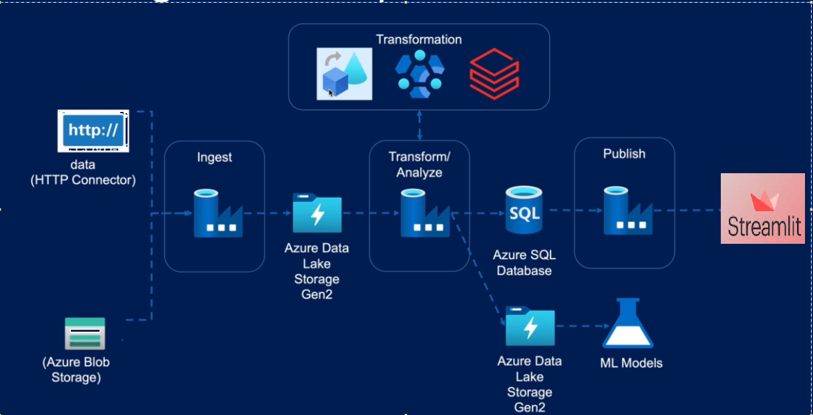

# Personal Finance : 

## 🌟 Featured on Streamlit community forum 🌟
 

<!-- everything tested  -->

Clairvoyant, an EXL company, is a global technology consulting and services leader that helps organizations in their business transformation by maximizing the value of data through actionable insights. Founded in 2012, Clairvoyant is headquartered in Phoenix, AZ, with offices in the US, Canada, and India and serves marquee clients in the financial services, retail, healthcare, and tech industries.
<p align = 'center' >
    
</p>
----------------------------

## High Level Design :
<p align = 'center' >
    
</p>

* So Initially I have used an <code>.ipynb</code> file to do the preprocessing and do some visualization

* Then I have made another Utilities Folder which contain <code>BusinessAnalysis.py</code> <code>CustomerAnalysis.py</code> to implement all the functions related to preprocessing and plotting

* I have imported the same file in <code>app.py</code> and used it along with streamlit to build the app.

------------------------------

----------------------------

## Approach : 

* So Initially I have used an <code>.ipynb</code> file to do the preprocessing and do some visualization

* Then I have made another Utilities Folder which contain <code>BusinessAnalysis.py</code> <code>CustomerAnalysis.py</code> to implement all the functions related to preprocessing and plotting

* I have imported the same file in <code>app.py</code> and used it along with streamlit to build the app.

------------------------------

## Features : 

* Shows multiple analytical charts to help me better understand the details.
* Connected to the database and automated. 
* Answers few predefined quick QNA type questions. 
* Responsive layout, can be opened in any device. 
------------------------------

## How to run? 

> To run the app you need to download this repository along with the required libraries and it the command line you have to write <code>streamlit run app.py</code> to run. 
------------------------------- 

## Document Structure 

```
Personal Finance 
│
|---- __pycache__
|
|---- .streamlit
|   |---- config.toml
|
|---- dataset 
|   xlsx files
|
|---- utilities
|   |---- __pycache__
|   |---- BusinessAnalysis.py
|   |---- CustomerAnalysis.py
|   
|
|
|---- app.py
|---- auth.py
|---- .py
|---- markdown.py
|---- Procfile 
|---- README.md
|---- requirements.txt
|---- setup.sh

```
---------------------
<p align="left">
    
    
    
    
    
    
</p>

## Technologies used : 

* python library - numpy, pandas, seaborn, matplotlib, streamlit
* version control - git 
* backend - streamlit
* concept - OOP

## Tools and Services : 
* IDE - Vs code 
* Application Deployment - Azure WebApp
* Code Repository - GitHub
* Dataset - SQL DB


-----------------------
<br>

# If you Liked this project the you can consider connecting with me:
* [LinkedIn](https://www.linkedin.com/in/shreyans-bardia/) 
